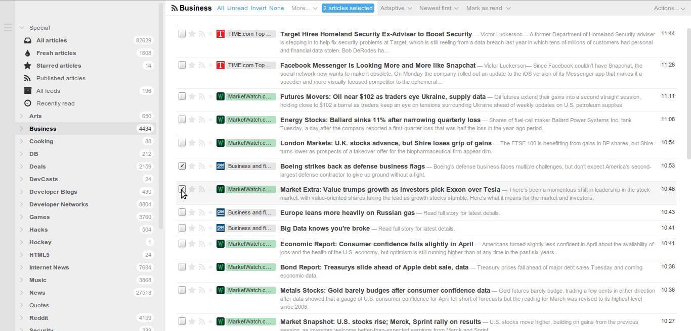

ttrss-theme-chalk 
================= 

A simplistic theme for the tt-rss reader based off of the work by [levito](https://github.com/levito/tt-rss-feedly-theme). 

Prerequisites

* ttrss version 1.8 or higher

Screenshot



Features

* New icons 
* Simple colors and spacing 
* Simplistic scrollbars (requires webkit browser like Chrome) 
 
Install 

1. Navigate to your ttrss themes directory
2. 
```
git clone https://github.com/asyncopation/ttrss-theme-chalk
```
3. Create symbolic links to css and images (or just copy/move them into the themes directory)

 ```ln -s ttrss-theme-chalk/chalk.css chalk.css```

 ```ln -s ttrss-theme-chalk/chalk_images chalk_images```
